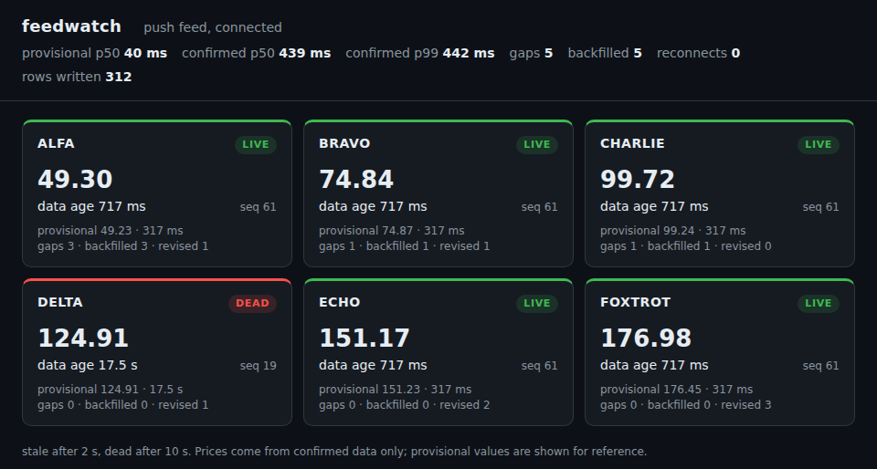
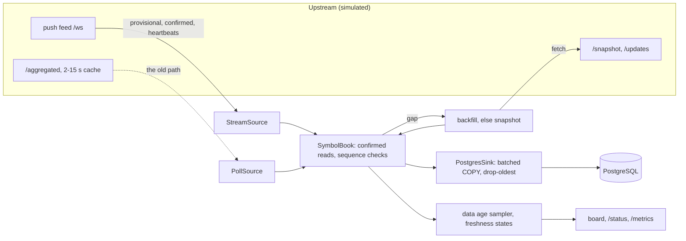

# feedwatch

Real-time market-data ingestion, measured: a push feed instead of polling, lag metrics, stale-data detection and confirmed reads, persisted to PostgreSQL.

[](https://github.com/awisecom/feedwatch/actions/workflows/ci.yml)

This is the data path of a live trading system I run, with the trading taken out: no strategies, no orders, no venue connectors, no keys. A simulator plays the upstream, so the whole thing runs on a laptop and every number below can be reproduced with one command.



## Three problems, three fixes

**1. The data was late.** Prices came from an aggregator API polled every few seconds. The poll interval was not the real problem: the aggregator itself served prices from a cache that refreshed every 2 to 15 seconds. Moving to the source's push feed fixed it.

```text
$ feedwatch compare --seconds 60
data age over 60 s, 6 symbols, sampled every 100 ms

                                       p50       p95       p99       max
polling the aggregator every 2 s     4.6 s    10.0 s    11.5 s    12.0 s
push feed, provisional              0.24 s    0.42 s    0.44 s    0.44 s
push feed, confirmed                0.64 s    0.82 s    0.83 s    0.84 s
```


**2. The state was sometimes wrong.** The fastest data on the feed is provisional and can still be revised; the confirmed version arrives one step (400 ms) later. Building state from provisional values meant acting on numbers that later changed. Now state is built from confirmed reads only, and provisional values are shown next to it, labelled. In the 60-second run above, 18 of 888 provisional values were revised by their confirmation.

**3. A dead feed looked like a quiet market.** When a feed stops, the last price just stays on the screen. Every symbol now has an explicit freshness state, `live`, `stale` or `dead`, derived from the age of its newest confirmed value, and every change is an event, a metric and a database row.

## Never wrong, even when the network is

Each update carries a per-symbol sequence number, and quantities are deltas, so a running total is only right if every confirmed event is applied exactly once. The watcher guarantees that:

- **Gaps are detected and repaired.** A jump in sequence numbers buffers what comes after it, fetches the missing range from the source (`/updates`), then drains the buffer in order. When the source no longer has that range, a snapshot replaces the state.
- **Tail losses are caught too.** A message lost right before a quiet period leaves no later message to reveal the gap, so heartbeats carry the last sequence number per symbol.
- **Duplicates are dropped, replays are idempotent.** Rows are written with `COPY` into a staging table and one `INSERT ... ON CONFLICT DO NOTHING`, so a backfill or reconnect never stores an event twice.
- **Dead connections are noticed.** No message for 3 seconds (the upstream heartbeats every second) means the path is dead even if TCP looks open. Reconnects use exponential backoff with full jitter.

The end-to-end test runs the simulator with 5% of confirmed messages dropped and the connection killed every 0.7 seconds, then freezes the source and checks that every symbol's sequence number and running total match the source exactly, and that the stored rows have no holes and no duplicates.

## Quick start

```bash
pip install -e ".[postgres]"

feedwatch compare --seconds 60                        # the finding above, reproduced

feedwatch sim --drop 0.01 --stall DELTA:30:20 &        # upstream with faults switched on
feedwatch run --upstream http://localhost:8765        # board, /status and /metrics on :8080

docker compose up --build                             # all of it, with PostgreSQL
```

## How it fits together



| Module | Job |
|---|---|
| [`book.py`](feedwatch/book.py) | Per-symbol state from confirmed reads: sequencing, buffering, backfill, snapshots, revision detection. Pure logic, no I/O |
| [`watcher.py`](feedwatch/watcher.py) | Wires sources, book, gap repair, sampling and the sink together |
| [`sources.py`](feedwatch/sources.py) | WebSocket client with idle timeout and backoff; the polling client it replaced |
| [`stats.py`](feedwatch/stats.py), [`staleness.py`](feedwatch/staleness.py) | Delivery lag vs data age, quantiles, Prometheus histograms, freshness states |
| [`sink.py`](feedwatch/sink.py), [`schema.sql`](feedwatch/schema.sql) | Non-blocking PostgreSQL writer with an explicit backpressure policy |
| [`sim.py`](feedwatch/sim.py) | The upstream: random walks, provisional and confirmed levels, cached aggregator, fault injection |
| [`status.py`](feedwatch/status.py) | The board above, JSON status, Prometheus metrics |

The reasoning behind each decision, the failure modes it handles and the SQL to query it: [docs/design.md](docs/design.md).

## Metrics

`/metrics` speaks the Prometheus text format: `feedwatch_delivery_lag_seconds` (histogram per channel), `feedwatch_data_age_seconds` (per symbol and level), `feedwatch_freshness` (per symbol and state), `feedwatch_events_total` (gaps, backfills, snapshots, revisions, reconnects), `feedwatch_connected`, and the sink's written, dropped and queued rows.

## Tests

37 tests: the book's sequencing rules one by one, the simulator, statistics and backoff, the HTTP side, the end-to-end fault run, polling vs push timing, and PostgreSQL integration (idempotent replays, no holes after backfill). CI runs them on Python 3.11, 3.12 and 3.13 against a PostgreSQL 16 service, with ruff and mypy in strict mode, then builds the Docker image and checks the compose demo end to end.

## Left out on purpose

Strategy logic, order execution, venue adapters and credentials. What is here is the plumbing that decides whether any of that sees correct, current data.

---

© 2026 Aleksander Wisniewski. Shared to show how I work; all rights reserved.
