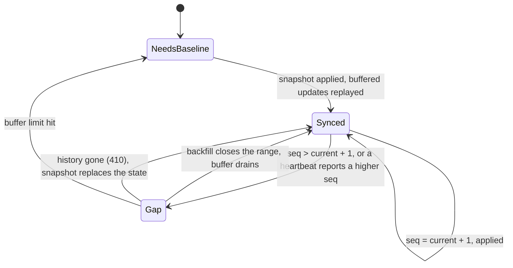

# Design notes

## The data model

An `Update` is one event for one symbol: the price after it and the quantity traded in it. Two properties make correctness checkable:

- **`seq` goes up by exactly 1 per event and symbol.** A missing number is a missed event; a repeated number is a duplicate.
- **`qty` is a delta.** The running total (`cum_qty`) is only right if every confirmed event is applied exactly once. That turns "is my state correct?" into an equality you can test against the source.

Each event exists at two levels. **Provisional** arrives first and may still change. **Confirmed** arrives one step later (400 ms) and never changes. A `Snapshot` is the confirmed state of a symbol as of one `seq`.

## Delivery lag vs data age

Two different numbers, and mixing them up is how the original problem hid:

| | Definition | Measured |
|---|---|---|
| delivery lag | receive time minus event time, per update | on every update, as a histogram |
| data age | now minus the event time of the newest value held | sampled every 100 ms, whether data arrives or not |

A poll that lands right after the aggregator refreshed its cache shows a small delivery lag for that one response, while everything downstream keeps working with data that is seconds old until the next refresh. Data age is what decisions run on, so freshness states are derived from it, and it is sampled continuously: a stopped feed produces no updates, so measuring only on arrival would never notice it.

Both numbers subtract an upstream timestamp from a local clock. In the simulator both clocks are the same. Against a real upstream, keep the host on NTP (chrony) and treat sub-10 ms differences as noise.

## Per-symbol state



Rules, all in `book.py` and covered by `tests/test_book.py`:

1. Subscribe first, then fetch the snapshot. Confirmed updates that arrive in between are buffered and replayed after it; anything at or below the snapshot's `seq` is dropped.
2. A confirmed update applies only if its `seq` is exactly `current + 1`. Lower is a duplicate (counted, ignored). Higher opens a gap: it and everything after it are buffered.
3. A gap is closed by fetching exactly the missing range from `/updates`. If the source answers 410 (outside its retained history), a snapshot is adopted instead.
4. Heartbeats carry the last confirmed `seq` per symbol. Without that, a message lost right before a quiet spell would go unnoticed until the next event, which might be minutes away.
5. Provisional updates never modify confirmed state. When the confirmed version of an event differs from its provisional one, it is recorded as a revision, which is the case that produced wrong state when provisional data was trusted.
6. The buffer is capped (10,000 updates). A gap open that long means starting again from a snapshot.

## Failure modes

| Failure | What happens |
|---|---|
| Message lost on the feed | Gap detected on the next update or heartbeat, range backfilled, state exact |
| Connection dies, TCP stays open | No message for `idle_timeout` (3 s) closes it; reconnect with backoff; gap repair covers what was missed |
| Upstream restarts | Same as above. Full-jitter backoff keeps many clients from reconnecting in lockstep |
| Gap older than the upstream's history | 410 from `/updates`, snapshot fallback; counted as `backfill_gone` |
| A symbol stops publishing | `live` to `stale` after 2 s, `dead` after 10 s; each transition is logged, counted and stored |
| Database down | Rows queue in memory; the writer reconnects with backoff; past 100,000 queued rows the oldest are dropped and counted |
| Database slow | Same queue absorbs it; the feed never waits for the database |
| Upstream resets its sequence numbers | Not handled here: sequences are assumed monotonic per symbol for the life of the upstream. A real venue adapter keys on (session, seq) |

## Storage

`schema.sql` is applied by the sink on start, under an advisory lock so two watchers never race on DDL. Every statement is idempotent.

- `ticks` has primary key `(symbol, seq)`. Batches go through `COPY` into a session-local temp table and then one `INSERT ... SELECT ... ON CONFLICT DO NOTHING`: bulk-load speed, and replays stay idempotent.
- The time index is BRIN, not B-tree. The table is append-only and written in time order, so BRIN stays a few pages no matter how large the table gets.
- `via` records whether a row arrived on the stream or through a backfill, so repairs stay visible after the fact.
- Prices are `double precision`. Fine for monitoring; anything that settles money would use `numeric`.

Useful queries:

```sql
-- Event to confirmed state, per symbol and minute (view shipped in schema.sql)
SELECT * FROM lag_per_minute WHERE minute > now() - interval '1 hour' ORDER BY minute, symbol;

-- Holes in the stored sequence: should be empty when every gap was backfilled
SELECT symbol, seq, next_seq
FROM (SELECT symbol, seq, lead(seq) OVER (PARTITION BY symbol ORDER BY seq) AS next_seq FROM ticks) s
WHERE next_seq <> seq + 1;

-- How long each symbol spent stale or dead today
SELECT symbol, to_state, count(*) AS times
FROM freshness_changes
WHERE at > date_trunc('day', now()) AND to_state IN ('stale', 'dead')
GROUP BY symbol, to_state ORDER BY times DESC;

-- How often provisional values were wrong, and by how much
SELECT symbol, count(*) AS revisions,
       avg(abs(confirmed_price - provisional_price) / provisional_price) * 10000 AS avg_bps
FROM revisions GROUP BY symbol;
```

## The simulator

`sim.py` is deliberately part of the project, not a test fixture: it is how the original behaviour (a 2 to 15 second aggregator cache) and the failure modes above are reproduced on demand. Every random choice comes from a seeded generator, so a run with `--seed` is repeatable. Fault switches: `--drop`, `--disconnect-every`, `--latency`, `--stall SYMBOL:AFTER:FOR`, `--revise`.
